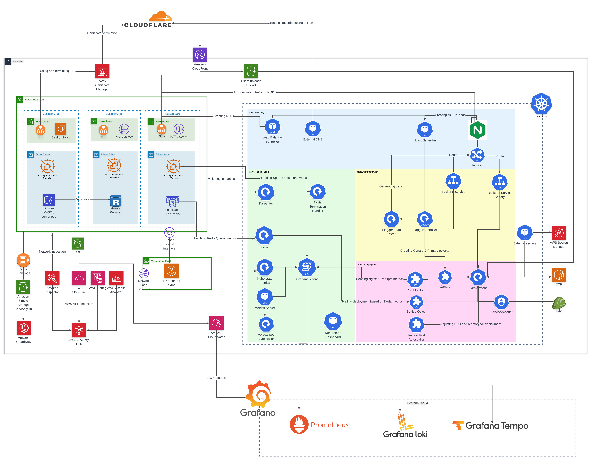

# Pulumi

You will need to install the `pulumi cli` - follow the
instructions [here](https://www.pulumi.com/docs/get-started/install/).

Once installed, run the following to authenticate pulumi:

```bash
cd infratructure
npm install
export AWS_PROFILE=<profile-name> # Your aws profile name, You can skip it if using default profile
pulumi login -c s3://1oakdigital-pulumi
```

You should now be able to see the provisioned resources with `pulumi stack`:

## Deploying a stack

Once `pulumi` is working, you can deploy a stack by simply running:

```bash
cd infrastructure
pulumi up
```

### Secrets

Secrets are also be managed by Pulumi. All secrets are encrypted by a key stored in
AWS KMS - in order to run `pulumi up`, you'll need to have access to that key.

You can create a new secret by running:

```bash
pulumi config set --secret <name> <value> -s <stack name (dev-api, qa-api etc...)>
```

Which will encrypt the secret and store it in `Pulumi.<stack>.yaml`. You can then
reference the secret in our infrastructure like this:

```typescript
const dbPassword = config.requireSecret('db_password')
```

If function needs to be exported to Parameter store, `configSecret` helper can be used

```typescript
const jwtSecretParameter = configSecret('jwt_secret')
```

When creating a new stack, pass the `--secrets-provider` flag like this to use
the encryption key.

```
pulumi stack init <stack> --secrets-provider="awskms://alias/pulumi?region=us-east-1"
```


## Layout
- index.ts - Main Pulumi file which deploys imported code
- stacks/ - Folder containing stack classes
- stacks/constructs/ - Reusable resource constructs which are used in stacks
- stacks/constructs/k8s - construct deployed inside Kubernetes cluster
- crd - Custom CRDS loaded with crd2pulumi tool


## Packages used
- [AWS Classic](https://www.pulumi.com/registry/packages/aws/)
- [AWSX](https://www.pulumi.com/registry/packages/awsx/)
- [Kubernetes](https://www.pulumi.com/registry/packages/kubernetes/)

## Custom resources Used
- [Keda Scaled Object](https://docs.flagger.app/tutorials/keda-scaledobject)
- [Flagger Canary](https://docs.flagger.app/tutorials/skipper-progressive-delivery)
- [Flagger Metrics Template](https://docs.flagger.app/usage/metrics#custom-metrics)
- [Vertical Pod autoscaller](https://github.com/kubernetes/autoscaler/tree/master/vertical-pod-autoscaler#example-vpa-configuration)


# AWS & Kubernetes resources



- [Virtual private cloud (VPC)](https://docs.aws.amazon.com/vpc/latest/userguide/configure-your-vpc.html)
  - [Nat Gateway](https://docs.aws.amazon.com/vpc/latest/userguide/vpc-nat-gateway.html)
- [Aurora MySQL](https://docs.aws.amazon.com/AmazonRDS/latest/AuroraUserGuide/Aurora.AuroraMySQL.html)
- [ElastiCache for Redis](https://docs.aws.amazon.com/AmazonElastiCache/latest/red-ug/WhatIs.html)
- [Elastic File System (EFS)](https://docs.aws.amazon.com/efs/latest/ug/whatisefs.html)
- [Elastic container registry (ECR)](https://docs.aws.amazon.com/AmazonECR/latest/userguide/what-is-ecr.html)


- [EKS cluster](https://docs.aws.amazon.com/eks/latest/userguide/clusters.html)
  - Addons:
    - [Amazon VPC CNI](https://docs.aws.amazon.com/eks/latest/userguide/managing-vpc-cni.html)
    - [CoreDNS](https://docs.aws.amazon.com/eks/latest/userguide/managing-coredns.html)
    - [kube-proxy](https://docs.aws.amazon.com/eks/latest/userguide/managing-kube-proxy.html)
  - [Managed Node groups](https://docs.aws.amazon.com/eks/latest/userguide/managed-node-groups.html)
  - Controllers
    - Load balancing, Ingress, DNS
      - [AWS Load Balancer Controller](https://kubernetes-sigs.github.io/aws-load-balancer-controller/v2.4/)
      - [Ingress Nginx](https://docs.nginx.com/nginx-ingress-controller/intro/overview/)
      - [External-DNS](https://github.com/kubernetes-sigs/external-dns)
        - [Chart](https://artifacthub.io/packages/helm/external-dns/external-dns)
    - Monitoring & Scaling
      - [Karpenter](https://karpenter.sh/v0.19.3/)
      - [Kube State Metrics](https://github.com/kubernetes/kube-state-metrics)
      - [Kubernetes Dashboard](https://kubernetes.io/docs/tasks/access-application-cluster/web-ui-dashboard/)
      - [Keda](https://keda.sh/)
      - [Grafana-agent](https://grafana.com/docs/grafana-cloud/data-configuration/agent/)
        - [Chart](https://github.com/grafana/helm-charts/tree/main/charts/agent-operator)
    - Deployment
      - [Flagger](https://flagger.app/)
      - [Flagger Load tester](https://artifacthub.io/packages/helm/flagger/loadtester)
    - Secrets & Volumes
      - [External Secrets](https://external-secrets.io/v0.6.1/)
      - [EFS](https://docs.aws.amazon.com/eks/latest/userguide/efs-csi.html)
  


## Connecting to EKS cluster

### Installation

Requirements:

- AWS account with permissions to assume arn:aws:iam::707053725174:role/dev-cluster-admin-role role
- [AWS CLI](https://docs.aws.amazon.com/cli/latest/userguide/getting-started-install.html)
- [kubectl](https://kubernetes.io/docs/reference/kubectl/)

[Kubectl installation for all OS types](https://kubernetes.io/docs/tasks/tools/#kubectl)

macOS installation:

```bash
brew install kubectl
```

### Getting crendentials

```bash
aws sts assume-role --role-arn arn:aws:iam::707053725174:role/dev-cluster-admin-role --role-session-name KubeAdmin # Assume role and get crendentials
aws configure --config kubeAdmin # add credentials from sts to new profile or use them directly
```

Or edit aws credentials file manually by adding following

```bash
[kubeAdmin]
role_arn = arn:aws:iam::707053725174:role/dev-cluster-admin-role
source_profile = <Your source profile which can assume this role>
```

Updating kubeconfig file

```bash
aws eks update-kubeconfig --region eu-west-2 --name dev #Update kubeconfig file
kubectl get pods # Check running pods in cluster
```


## CRDS
To generate CRDS **[crd2pulumi](https://github.com/pulumi/crd2pulumi])** is used

```bash
brew install pulumi/tap/crd2pulumi
crd2pulumi help
```
Updating existing CRDS
```bash
./bin/update-crds.sh 
```